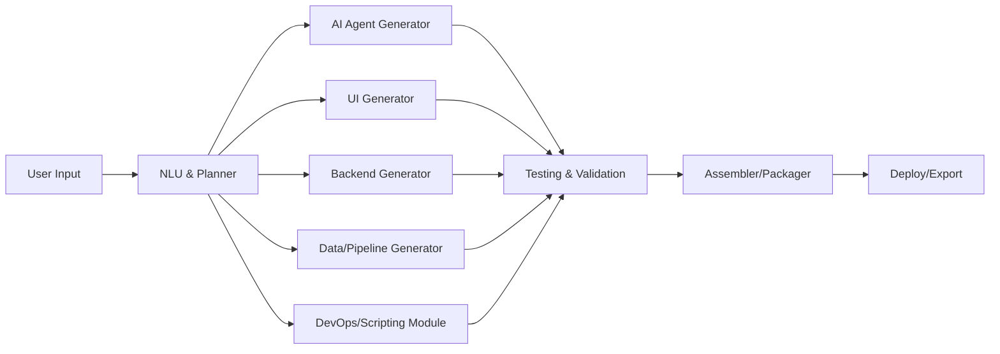

# Coder Agent
This is going to be an coder agent, with Gradio frontend and LangChain backend. But the idea is to design the agent with Vibe coding. 

## Version3: Simple Agent
* This version with the same interface is going to have access to disk to read/write files.
* This is a design for it using mermaid:

## Version 2: Chatbot with session and access to code
* For this version, we want to have sessions to remember the coding and all the dev done on it. [added 06/25/2025]

## Version 1: Chatbot
* The first version is generated using gemini.google.com and is a simple chatbot with Gemini models.
* switched to GPT4.1 to generate first version. This is the stable version now. [aaded on 06/24/2025]

# To Implement:
* Streaming the chatbot
* Adding the option to switch between different google models as well as openai or other providers.
* Reading files in the directory and creating summaries for files, function and code objects.
* Logging all chat interactions for the current project. Putting all logs and summaries into a dev folder.
* Capabilities to version control the dev using github.

# 05/25/2025
* We started with a simple chatbot to get to current state.
* Divided the agent into two copies: 
    1. The developing copy is the copy which is under development. 
    2. The stable copy that will be running to develop the other copy.
